# Machines virtuelle

## Installation


```
Pour la machine ServerTest :
host        ServerTest
user        jc
mp          dev
```


### Config virtualbox
1. Télécharger la dernière version d'ubuntu serveur __LTS__ (Long Time Support), soit ìci `ubuntu-16.04.1-server-i386`
1. Installer virtualbox
1. Cliquer sur "_Nouvelle_".


1. Nommer votre nouvelle machine virtuelle, choisir son "_type_" (Linux) et sa "_version_" (ubuntu 64bit). Laisser les autres paramètres inchangés. Ensuite faire "_Créer_".


1. Vous pouvez changer l'emplacement du dossier, mais ici nous le laisserons par défaut. Maintenant cliquer sur "_Créer_".
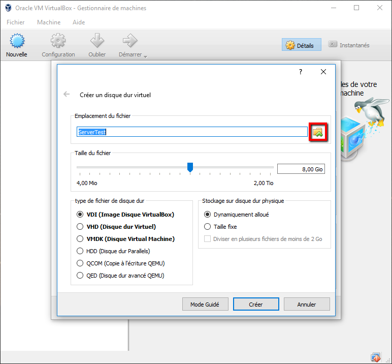

1. Cliquer du droit sur votre nouvelle machine et sélectionner "_Configuration_".
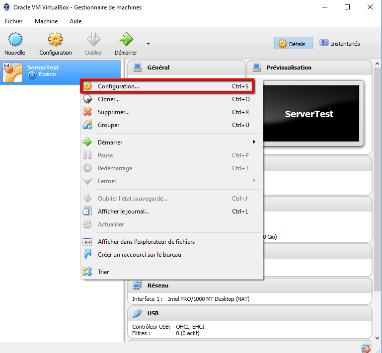

1. Cliquer ensuite sur l'onglet "_Stockage_" -> "_Controleur : IDE_" -> "_Vide_" et enfin cliquer sur la petite image en forme de disque.


1. Sélectionner "_Choisissez un fichier de disque optique virtuel..._"


1. Sélectionner votre image d'ubuntu serveur, cliquer sur "_Ouvrir_" et ensuite faire "_OK_" pour sortir du menu.
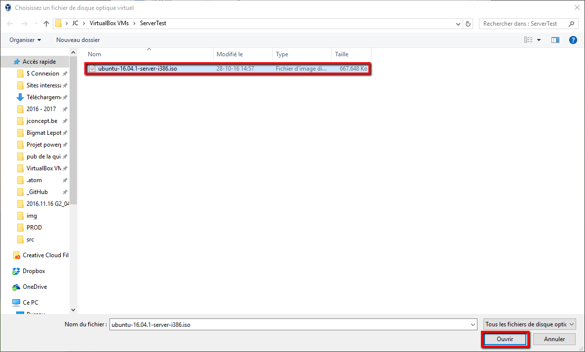

1. Vous pouvez à présent sélectionner "_Démarrer_" pour lancer la partie [Configuration du serveur](#config-serveur).
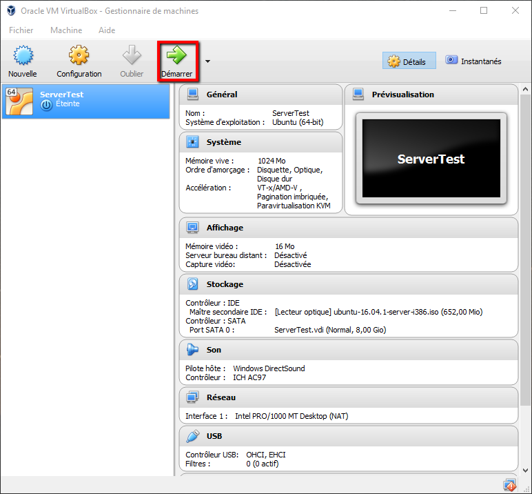


### Config serveur
1. Votre machine démarre.


1. Sélectionner "_English_"(pour sélectionner quelque chose appuyer sur la touche `ENTER` pour vous déplacer utiliser les flèches du clavier ou `TAB`).
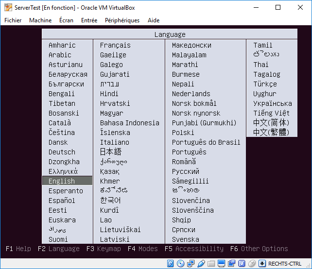

1. Sélectionner "_Install Ubuntu Server_".


1. Sélectionner à nouveau "_English_".


1. Sélectionner "_other_".


1. Sélectionner "_Europe_".


1. Sélectionner "_Belgium_".


1. Laisser par défaut.


1. Sélectionner "_Yes_" pour qu'Ubuntu détecte votre clavier et répondez aux quelques questions qu'il va vous poser.


1. Maintenant il sait quel clavier vous avez et faire "_Continue_".


1. Vous allez avoir des écrans de chargement.


1.  Ne rien faire jusqu'à ce que vous ayez ceci. Maintenant entrez le "_Hostname_" de votre machine (c'est le nom que prendra la machine sur le réseau).


1. Ici vous allez choisir le nom complet de votre compte utilisateur.


1. Ici vous allez choisir le nom de votre compte utilisateur.
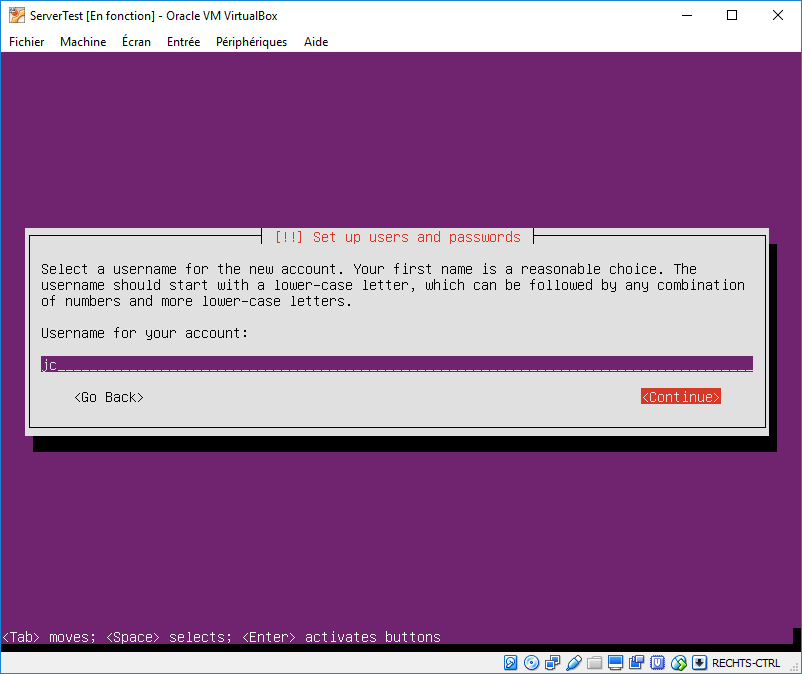

1. Maintenant vous allez choisir le mot de passe de votre compte. Vous allez devoir l'entrer une seconde fois pour le confirmer.


1. Si vous avez choisit un mot de passe trop faible, vous aurez ce message qui apparait, faire "_Yes_" pour continuer avec ce mot de passe.
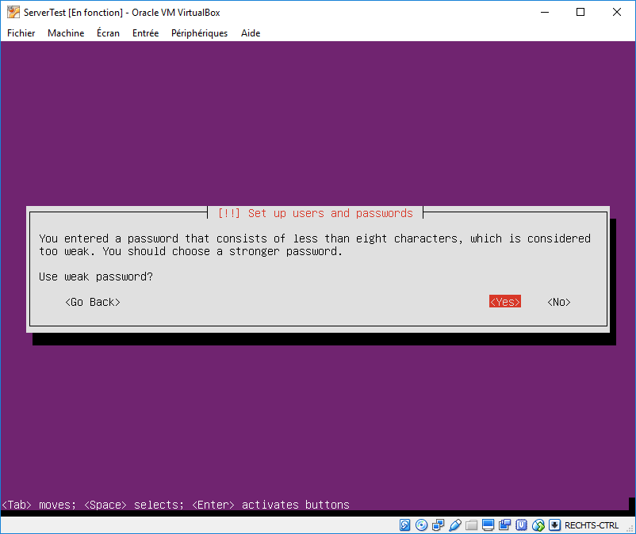

1. Choisir "_No_" car il nous demande si on veut crypter les données du serveur.


1. Vous allez avoir une fenêtre de chargement.


1. Vérifier que vous êtes correctement localisé, si oui faites "_Yes_".


1. Vous allez avoir à nouveau une fenêtre de chargement.
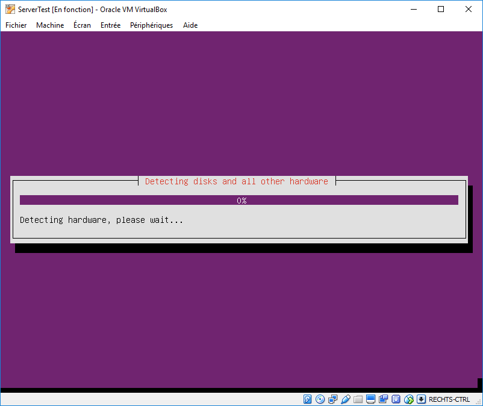

1. Laisser les paramètres par défaut.
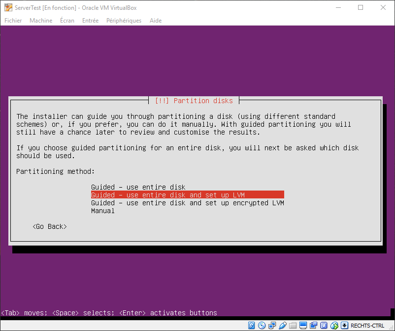

1. Encore laisser par défaut.


1. Sélectionner "_Yes_".
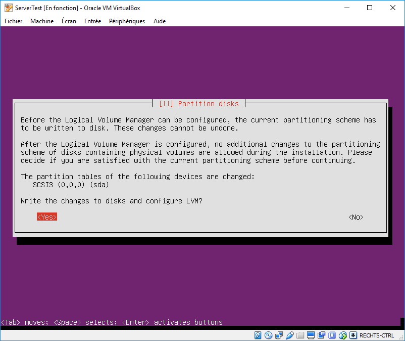

1. Encore laisser par défaut et faire "_Continue_".


1. Sélectionner "_Yes_".


1. Vous allez avoir une fenêtre de chargement.


1. Ne rien encoder et faire "_Continue_".
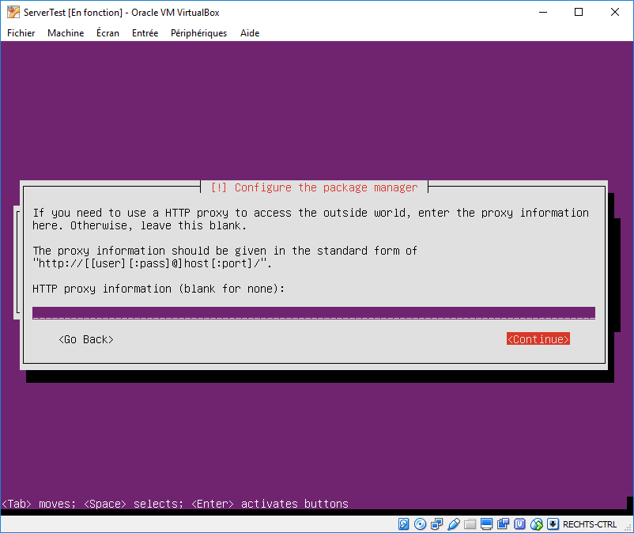

1. Encore une page de chargement.
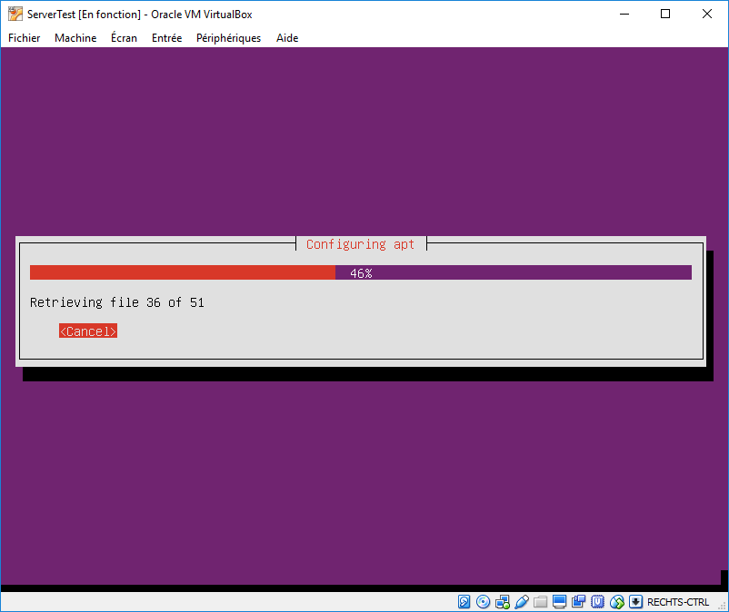

1. Laisser "_No automatic updates_".


1. Maintenant avec la touche `ESPACE`, cocher __"openSSH server"__ et laisser __"standard system utilisties"__ .


1. Page de chargement.


1. Sélectionner "_Yes_".
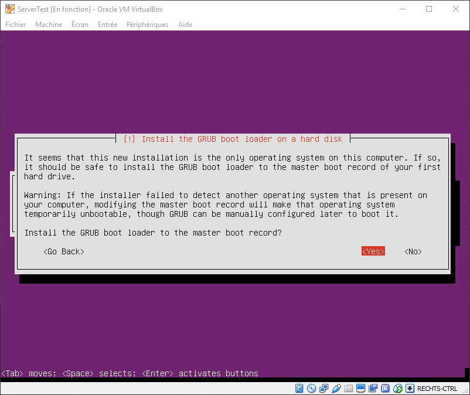

1. Le serveur finit de se configuerer.


1. Et voilà, vous avez terminé l'installation. Faire "_Continue_" pour accéder au serveur.


## Importer une nouvelle machine
```
Pour la machine hepl-rsv :
user        student
mp          student
```
Avec le fichier en OVA, `hepl-rsv.ova`, nous allons l'importer dans virtualBox.
1. Soit double cliquer sur le fichier soit dans virtualBox aller dans "_Fichier_" -> "_Importer un appareil virtuel..._"


1. Cliquer sur l'icone de dossier. Et sélectionner le fichier _hepl-rsv.ova_.


1. Cliquer sur suivant.


1. Laisser les paramètres par défaut (vous pouvez changer le nom de la machine dans le champs "`Nom`"). Et cliquer sur importer.


1. Patienter jusqu'à que la machine soit importée.
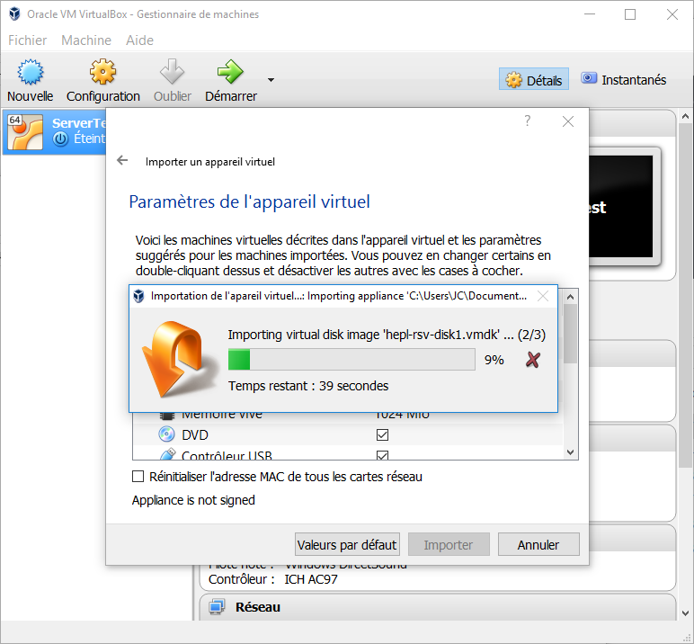


## COMMANDES :

```
sudo shutdown now
```
> pour arrêter le système + mp user

```
ifconfig
```
> pour connaitre l'adresse ip et les parmètres de la carte réseau

__Pour plus de commandes reportez vous au cours [hepl-rsv/terminal](https://github.com/hepl-rsv/terminal)__
