# Machines virtuelles

Forked on : [https://github.com/hepl-rsv/VirtualBox-install](https://github.com/hepl-rsv/VirtualBox-install)

## Installation

```
Pour la machine ServerTest :
host        ServerTest
user        jc
mp          dev
```


### Configurer virtualbox
1. Télécharger la dernière version d'ubuntu serveur __LTS__ (Long Time Support), soit ìci `ubuntu-16.04.1-server-i386`
1. Installer virtualbox
1. Cliquer sur "_Nouvelle_".
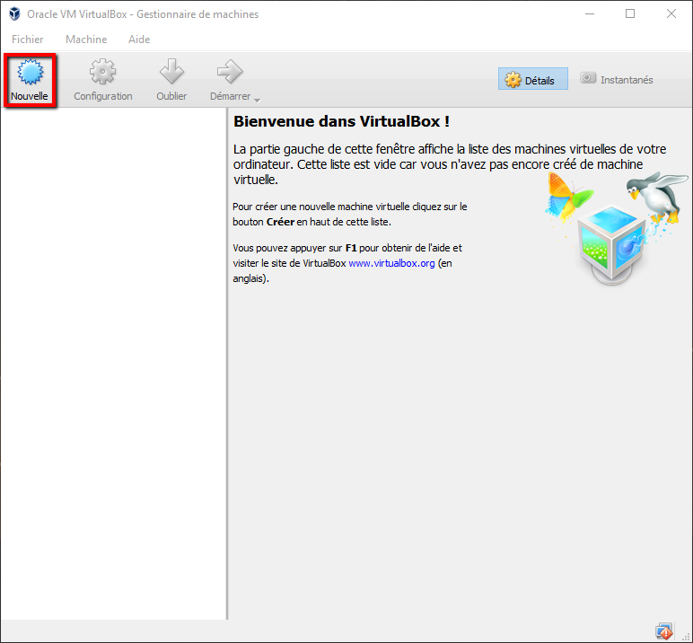

1. Nommer votre nouvelle machine virtuelle, choisir son "_type_" (Linux) et sa "_version_" (ubuntu 64bit). Laisser les autres paramètres inchangés. Ensuite faire "_Créer_".


1. Vous pouvez changer l'emplacement du dossier, mais ici nous le laisserons par défaut. Maintenant cliquer sur "_Créer_".


1. Cliquer du droit sur votre nouvelle machine et sélectionner "_Configuration_".


1. Cliquer ensuite sur l'onglet "_Stockage_" -> "_Controleur : IDE_" -> "_Vide_" et enfin cliquer sur la petite image en forme de disque.
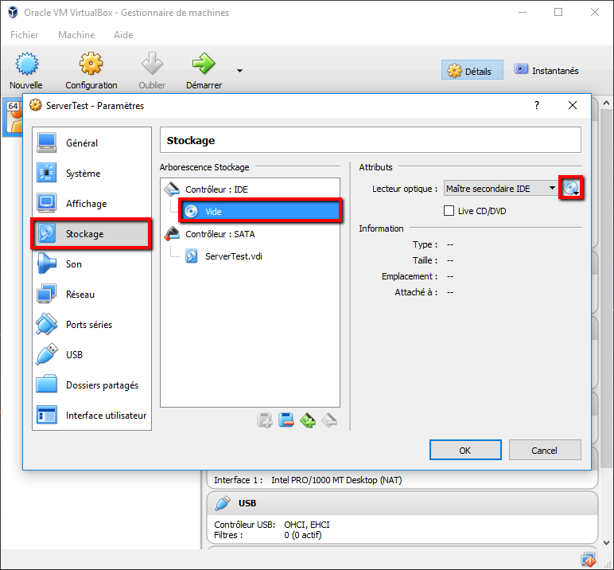

1. Sélectionner "_Choisissez un fichier de disque optique virtuel..._"


1. Sélectionner votre image d'ubuntu serveur, cliquer sur "_Ouvrir_" et ensuite faire "_OK_" pour sortir du menu.


1. Vous pouvez à présent sélectionner "_Démarrer_" pour lancer la partie [Configuration du serveur](#config-serveur).


### Installer le serveur
1. Votre machine démarre.


1. Sélectionner "_English_"(pour sélectionner quelque chose appuyer sur la touche `ENTER` pour vous déplacer utiliser les flèches du clavier ou `TAB`).


1. Sélectionner "_Install Ubuntu Server_".
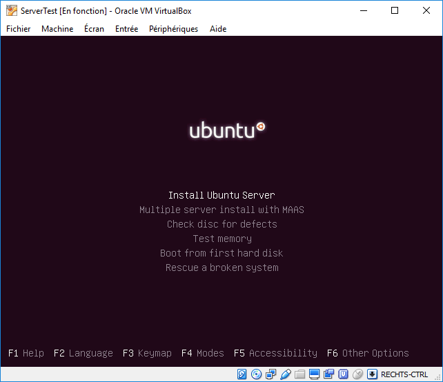

1. Sélectionner à nouveau "_English_".
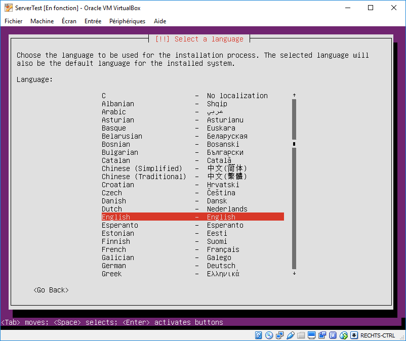

1. Sélectionner "_other_".


1. Sélectionner "_Europe_".


1. Sélectionner "_Belgium_".


1. Laisser par défaut.


1. Sélectionner "_Yes_" pour qu'Ubuntu détecte votre clavier et répondez aux quelques questions qu'il va vous poser.
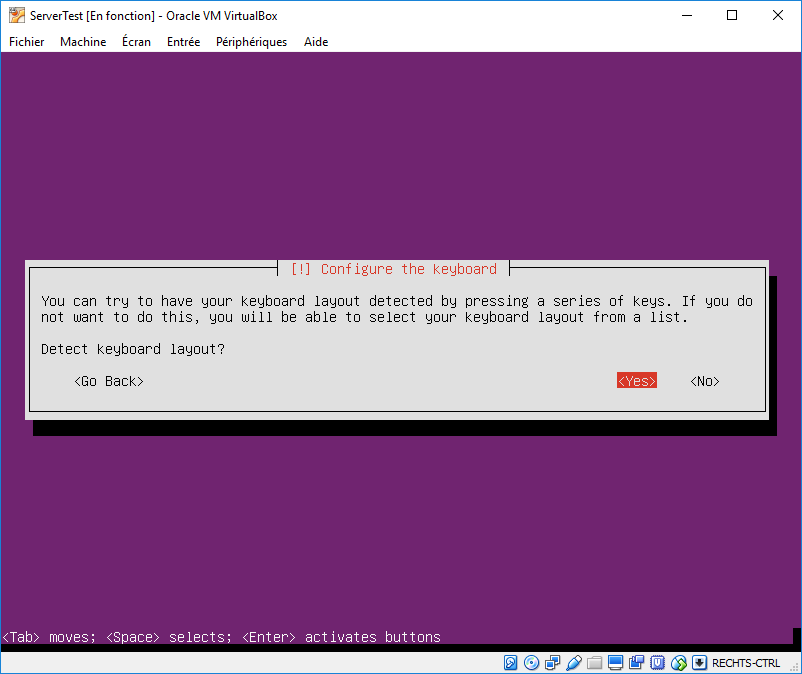

1. Maintenant il sait quel clavier vous avez et faire "_Continue_".


1. Vous allez avoir des écrans de chargement.


1.  Ne rien faire jusqu'à ce que vous ayez ceci. Maintenant entrez le "_Hostname_" de votre machine (c'est le nom que prendra la machine sur le réseau).
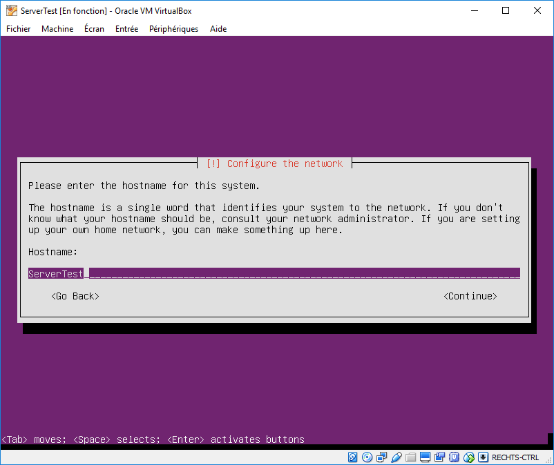

1. Ici vous allez choisir le nom complet de votre compte utilisateur.
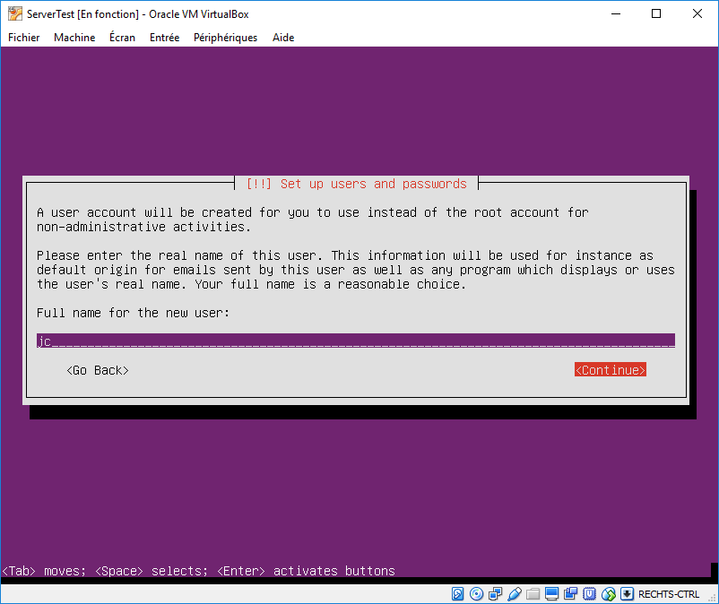

1. Ici vous allez choisir le nom de votre compte utilisateur.


1. Maintenant vous allez choisir le mot de passe de votre compte. Vous allez devoir l'entrer une seconde fois pour le confirmer.


1. Si vous avez choisit un mot de passe trop faible, vous aurez ce message qui apparait, faire "_Yes_" pour continuer avec ce mot de passe.


1. Choisir "_No_" car il nous demande si on veut crypter les données du serveur.
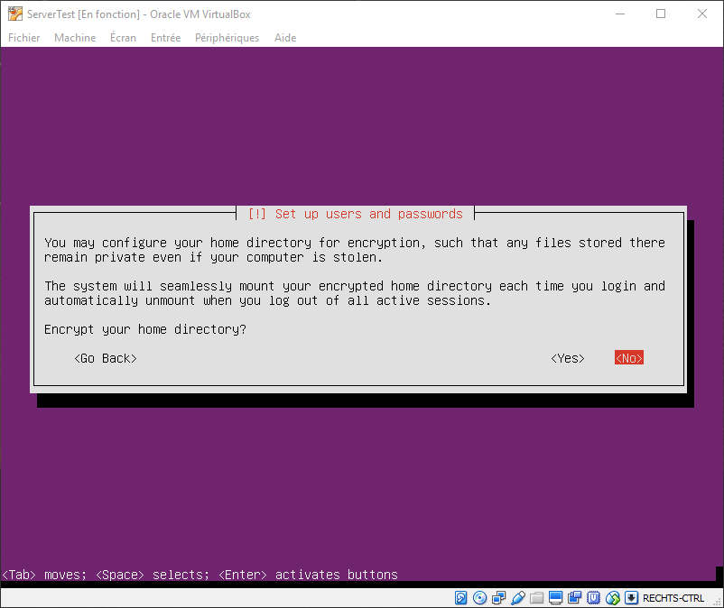

1. Vous allez avoir une fenêtre de chargement.
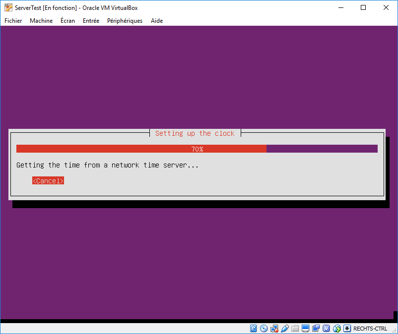

1. Vérifier que vous êtes correctement localisé, si oui faites "_Yes_".


1. Vous allez avoir à nouveau une fenêtre de chargement.


1. Laisser les paramètres par défaut.


1. Encore laisser par défaut.
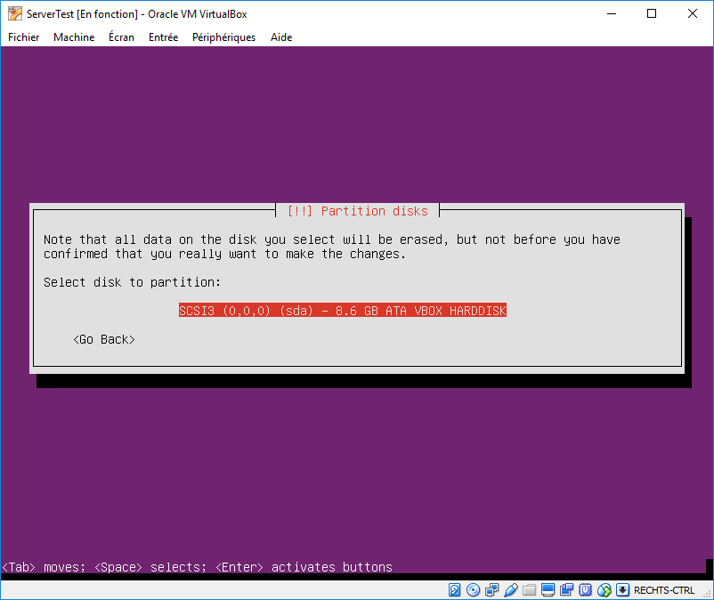

1. Sélectionner "_Yes_".


1. Encore laisser par défaut et faire "_Continue_".


1. Sélectionner "_Yes_".
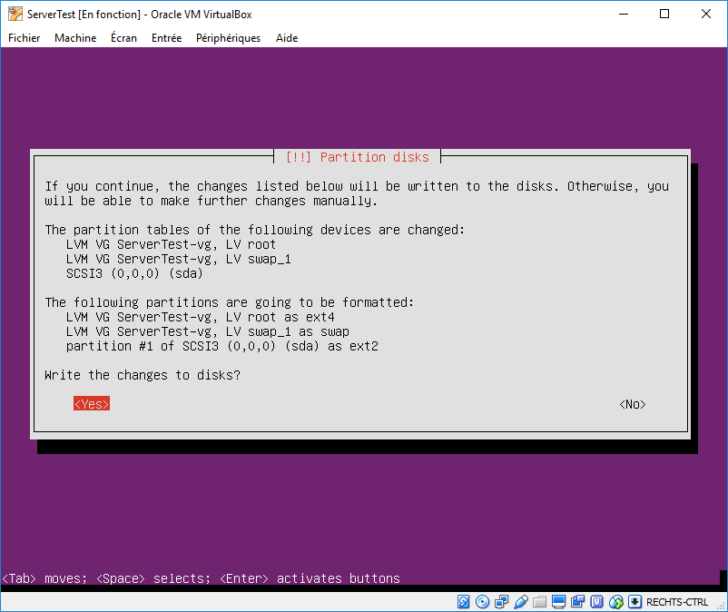

1. Vous allez avoir une fenêtre de chargement.


1. Ne rien encoder et faire "_Continue_".


1. Encore une page de chargement.


1. Laisser "_No automatic updates_".
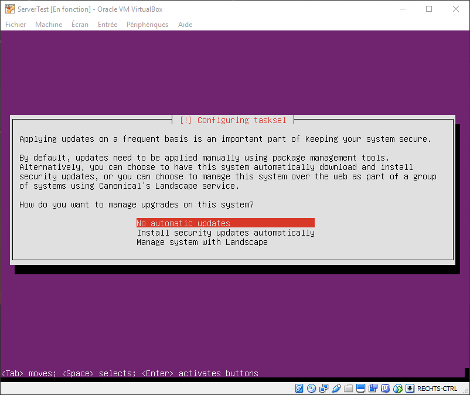

1. Maintenant avec la touche `ESPACE`, cocher __"openSSH server"__ et laisser __"standard system utilisties"__ .


1. Page de chargement.
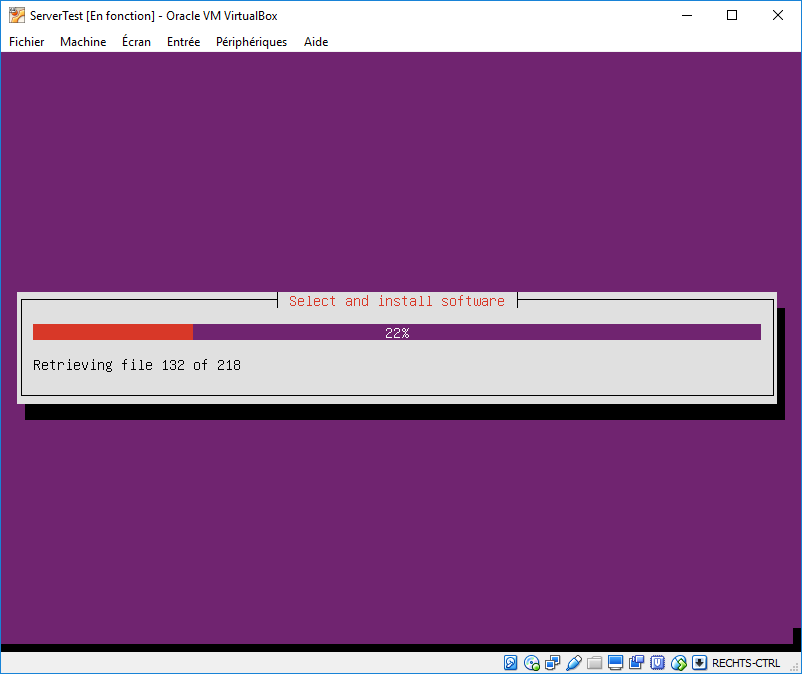

1. Sélectionner "_Yes_".


1. Le serveur finit de se configuerer.


1. Et voilà, vous avez terminé l'installation. Faire "_Continue_" pour accéder au serveur.
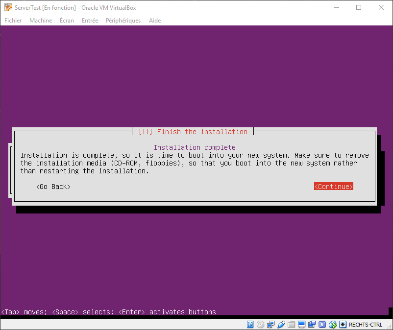


## Importer une nouvelle machine
```
Pour la machine hepl-rsv :
user        student
mp          student
```
Avec le fichier en OVA, `hepl-rsv.ova`, nous allons l'importer dans virtualBox.
1. Soit double cliquer sur le fichier soit dans virtualBox aller dans "_Fichier_" -> "_Importer un appareil virtuel..._"
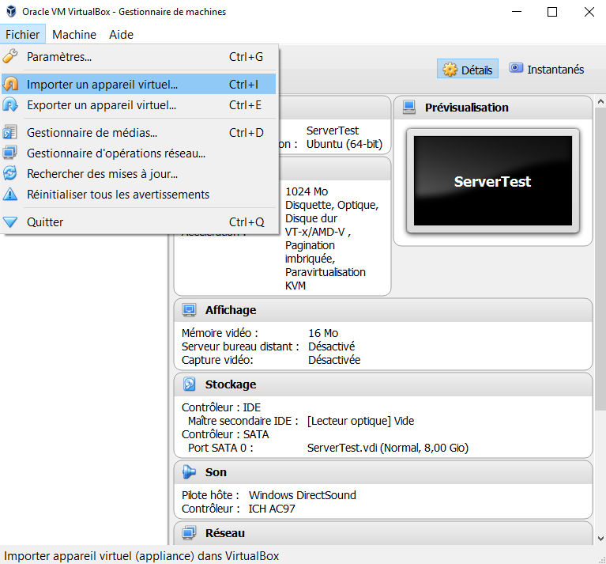

1. Cliquer sur l'icone de dossier. Et sélectionner le fichier _hepl-rsv.ova_.


1. Cliquer sur suivant.


1. Laisser les paramètres par défaut (vous pouvez changer le nom de la machine dans le champs "`Nom`"). Et cliquer sur importer.
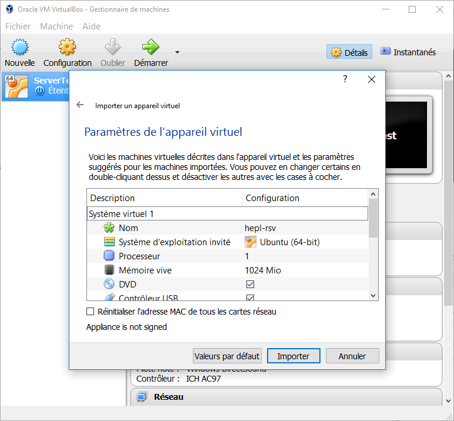

1. Patienter jusqu'à que la machine soit importée.


## Configurer le serveur :

Maintenant que vous avez installé votre machine virtuel, voici comment la configurer pour qu'elle devenienne un serveur en installant dans un premier temps les services d'`apache` et en configurerant correctement ses fichiers.

Voici toutes les commandes à taper (dans l'ordre) afin d'arriver au résultat recherché.

Tout d'abords entrer l'utilisateur (user)


Ainsi que le mot de passe (mp)


Vous devriez obtenir ceci (désormais, je ne mets plus de captures d'écran, juste les commandes à taper sur la machine) :


> __Mettre à jour la liste de tous les packages__ (~programmes) devant être présent sur la machine (Vous devrez probablement entrer à nouveau le mp)

```
sudo apt-get update
```

> Faire de même pour lancer __l'installation des mises à jour des packages__ (il vous demandera de confirmer l'installation, entrer `y` + `ENTER`)

```
sudo apt-get upgrade
```

> Si le clavier n'est pas bien configuré __ÉTAPE NON NÉCESSAIRE__ _vous pouvez sauter directement à l'étape suivante_

```
sudo dpkg-reconfigure keyboard-configuration
```

> Pour installer apache2 (il vous demandera de confirmer l'installation, entrer `y` + `ENTER`)

```
sudo apt-get install apache2
```

--------------------------------------------------------------------

__J'ai l'impression qu'il manque des étpaes__

--------------------------------------------------------------------

Nous venons de mettre à jour notre machine et avons installé apache. Maintenant nous allons vérifier que la machine réponde correctement avec le terminal (git pour windows).

__Sur la machine :__
> Prendre l'adresse ip (permet de connaitre aussi les parmètres de la carte réseau)

```
ifconfig
```

Maintenant __dans le terminal__ (ou dans git), nous allons faire un ping sur l'adresse du serveur, dans notre cas `ping 192.168.56.102`


Si vous obtenez une perte de 0%, nous pouvons continuer et __faire la redirection de ports.__
Dans virtualBox faites un clic droit sur votre machine et sélectionez `Configuration...` -> `Réseau` -> `Avancé` -> `redirection de ports`


Cliquer sur `Ajouter une nouvelle règle de redirection` (icone verte à droite) et entrer les donnes suivantes et faire `OK` quand vous avez finit __PAS de redémarage requis pour la VM__


> __Dans le terminal__ (ou dans git) taper :  
> __ATTENTION__ remplacer `student` par votre user

```
$ ssh -l student -p 2222 127.0.0.1
```

-------
# incomplet à éditer
-------

> Aller dans le dossier web d'appache `/var/www`. Nous allons modifier la page par défaut d'apache

```
cd /var/www/html
```

> Lister le contnu du dossier

```
ls -FAlh
```

> Regardons ce que contient le fichié index.html

```
cat index.html
```

Vous pouvez voir ce que ça donne en ouvrant votre navigateur et en entrant http://127.0.0.1:2080/

> Maintenant supprimer cette page par défaut (il vous demande de confirmer, entrer `y` + `ENTER`)

```
rm index.html
```

> Vous allez avoir une erreur de type `Permission denied`, c'est normal vu qu'il faut être en admin pour pouvoir le supprimer. Alors petite astuce pour mettre le sudo à la commande précédemment tappée (il va vous demander le mot de passe et il n'y aura plus d'erreurs)

```
sudo !!
```

> Créer un nouveau fichier index.html et n'oublions pas cette fois-ci de préfixer notre commande de sudo.

```
sudo nano index.html
```

Introduire dans le nouveau fichier `Hello world !` par exemple et faire `CTRL` + `O` pour sauvegarder et puis `ENTER` pour confirmer ensuite `CTRL` + `X` pour quitter

> Afficher le contenu de votre index pour vérifier vos modifications

```
cat index.html
```

> Accéder maintenant au dossier contenant les sites

```
cd /etc/apache2/sites-enabled
```

> Créer le dossier de votre premier site

```
sudo mkdir first-website
```

> Entrer dans son dossier

```
cd first-website
```

> Créer la page d'accueil du site (même oppération que tout à l'heure MAIS ne pas mettre le même contenu, ici par exemple mettre `Hey !` + refaire un cat pour vérifier le contenu)

```
sudo nano index.html
```

> Accéder au `sites-available` c'est dans ce dossier que l'on met en relation les dossiers avec le contenu navigable du serveur.

```
cd /etc/apache2/sites-available
```

> Regarder le contenu de ce dossier

```
ls -FAlh
```

> Éditer le fichier `000-default.conf`

```
sudo nano 000-default.conf
```

À la ligne `DocumentRoot /var/www/html` remplacer par `DocumentRoot /etc/apache2/sites-enabled/first-website` (ensuite faire la même chose pour enregistrer et quitter, expliqué ci-dessus)

> Redémarer le service apache pour qu'il tienne compte des modifications

```
sudo service apache2 reload
```

> Pour complètement relancer tout le service on peut aussi faire ceci

```
sudo service apache2 restart
```

> pour arrêter le système (+ mp user)

```
sudo shutdown now
```

__Pour le prochain démarrage de la machine,__ faites clic droit -> `Démarrer` -> `Démarrage sans affichage` car par la suite on utilisera uniquement la machine en ligne de commande par ssh avec le terminal (ou git).


---------------------------------------------

>

```

```

>

```

```


__Pour plus de commandes reportez vous au cours [hepl-rsv/terminal](https://github.com/hepl-rsv/terminal)__
